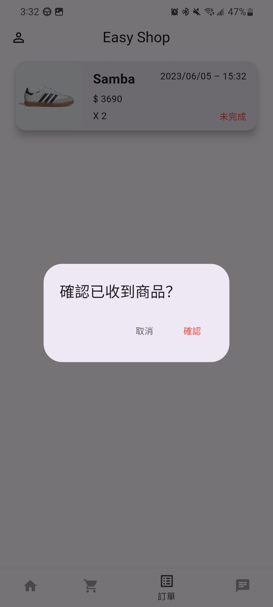

# 資料庫專題 - 購物APP  

Flutter實作UI：

<table>
  <tr>
    <td></td>
    <td></td>
    <td></td>
    <td></td>
  </tr>
  <tr>
    <td align="center">• 初始畫面</td>
    <td align="center">• 登入</td>
    <td align="center">• 註冊</td>
    <td align="center"></td>
  </tr>
  <tr>
    <td></td>
    <td></td>
    <td></td>
    <td></td>
  </tr>
  <tr>
    <td align="center">• 無商品頁</td>
    <td align="center">• 新增商品頁</td>
    <td align="center">• 有商品頁</td>
    <td align="center">• 商品詳細頁</td>
  </tr>
  <tr>
    <td></td>
    <td></td>
    <td></td>
    <td></td>
  </tr>
  <tr>
    <td align="center">• 購物車頁</td>
    <td align="center">• 移除項目</td>
    <td align="center">• 購物車頁(移除後)</td>
    <td align="center">• 右上角結帳</td>
  </tr>
  <tr>
    <td></td>
    <td></td>
    <td></td>
    <td></td>
  </tr>
  <tr>
    <td align="center">• 結帳頁</td>
    <td align="center">• 訂單頁</td>
    <td align="center">• 長按訂單</td>
    <td align="center">• 訂單已完成</td>
  </tr>
  <tr>
    <td></td>
    <td></td>
    <td></td>
    <td></td>
  </tr>
  <tr>
    <td align="center">• 買家方聊天頁</td>
    <td align="center">• 賣家方聊天頁</td>
    <td align="center">• 聊天室</td>
    <td align="center">• 聊天室</td>
  </tr>
</table>

--  

SQLite  
```
member ──┬── _id (PK)
         ├── name
         ├── phone
         ├── email
         ├── password
         ├── review
         └── review_count
         
product ──┬── _id (PK)
          ├── owner_id
          ├── description
          ├── price
          ├── imgURL
          └── inventory
          
cart ──┬── member_id (PK)
       ├── product_id (PK)
       └── product_number
       
order ──┬── _id (PK)
        ├── buyer_id
        ├── seller_id
        ├── product_id
        ├── product_number
        ├── time
        ├── address
        └── completed
        
chatroom ──┬── _id (PK)
           ├── buyer_id
           └── item_id
           
message ──┬── _id (PK)
          ├── room_id 
          ├── sender_id 
          ├── send_time
          └── message_string
        
```
